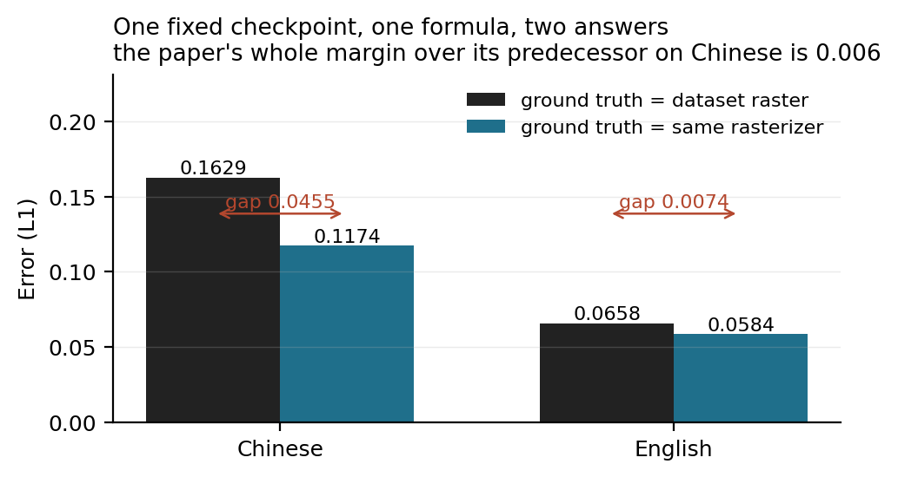

# Reproducing DeepVecFont-v2, and testing whether a sweep over it can resolve anything

Final project, part 2. Generative Models for Text and Images, Reichman University.

Paper: Wang, Wang, Yu, Zhu, Lian. *DeepVecFont-v2: Exploiting Transformers to Synthesize
Vector Fonts with Higher Quality.* CVPR 2023. Course topic: autoregressive models.
Code: fork of `yizhiwang96/deepvecfont-v2`. All our work is the `main..repro` diff.

*The same letter B, from a font in the English test split. The model reads and writes the
command sequence in panel 4. The score everyone reports compares panel 5. Most of what this
report measures turns out to live in the distance between those two panels.*

## Abstract

We reproduce DeepVecFont-v2 on Chinese and English vector font synthesis, then run 21
single-factor changes to the architecture against it.

Our reconstruction scores 0.1621 on Chinese against the paper's reported 0.080. To find out
why, we ran the authors' own released weights through our evaluation code. They score
0.1629, which is 0.0008 from our number. The reproduction is therefore faithful, and the
distance to the published figure comes from the evaluation, not from our training.

Before changing anything we trained the baseline three times with different random seeds and
measured how far apart the results landed. That spread is 0.0097. All 26 candidate
configurations together span 0.0101. Changing the architecture moved the metric about as much
as changing the seed. One change — adding noise to the encoder during training — has the same
sign at every seed on both Chinese metrics, but both deltas sit inside the pre-registered noise
floor (section 5.3); we report it as a direction, not a gain. One change reliably makes things
worse. The rest are indistinguishable from noise. An external review of an earlier draft
challenged the noise-floor reading and the checkpoint-selection criterion; section 5.6 answers
both with a rebuilt dataset and rendered-metric checkpoint selection, and reaches the same null
reading on every candidate, this time from a floor that came back 63% wider.

---

## 1. Original architecture

DeepVecFont-v2 generates a full vector font from a few reference glyphs. It uses two
modalities at once: a 64×64 raster image of each glyph and the glyph's outline as a sequence
of drawing commands.

*The vocabulary, on real data. A **glyph** is one character drawn in one style; a **font** is
a whole alphabet drawn consistently. Its **outline** is built from segments, either straight
or **cubic Bézier**, where each curve is fixed by two **on-curve points** it passes through
and two **control points** it does not. To **render** is to turn that outline into pixels.
The model never emits a raw coordinate: it picks one of 128 **bins** per axis, so it can
only place a point on that grid. And it works **few-shot**, seeing four reference glyphs and
having to draw the other forty-eight.*

**Encoders.** A CNN encodes the reference images. A Transformer encodes the reference
command sequences. The two are fused into one latent vector per font.

**Decoders.** Three heads read that latent. A CNN decodes a raster image. An autoregressive
Transformer decoder emits the command sequence one token at a time. A second Transformer
decoder then refines the whole sequence in parallel. **The refined sequence is what gets
scored**, which matters later.

**Representation.** Each command is a type plus 8 coordinate arguments. Coordinates are
quantized to a fixed grid of bins and predicted as a classification over bins, which is what
makes the model autoregressive rather than a regressor. The paper adds a relaxation
representation so gradients can flow through the discrete arguments, and a Bézier alignment
loss that pulls sampled points on the predicted curve toward the target curve.

**Loss.** A weighted sum of an image L1 term, a command-type cross-entropy, a coordinate-bin
cross-entropy, the Bézier alignment term, and a KL term on the latent.

**Key hyperparameters**, as shipped and as used by us:

| | Value |
|---|---|
| Optimizer, learning rate | Adam, 2e-4 |
| Batch size | 32 |
| Image size | 64×64 |
| Coordinate bins | 128 |
| Transformer width, encoder depth | 512, 6 |
| Reference glyphs | 4 (English), 8 (Chinese) |
| Max sequence length | 51 (English), 71 (Chinese) |
| Loss weights | image L1 10, Bézier 0.01, point 0.01 |
| Parameters | 136,055,207 |

### 1.1 Where the released code differs from the paper

We read the paper against the code. Four differences matter, and three of them became
experiments in section 4.

| Paper says | Code does |
|---|---|
| Coordinate arguments in **256** dimensions | quantizes to **128** bins |
| Self-refinement is a **2-layer** decoder | builds **1** layer |
| Bézier loss weighted at **1.0** | `loss_w_aux = 0.01`, 100× lower |
| The `N(0,I)` perturbation is an **inference-time** device | applied in training, validation and test alike |

Two more, found late, affect how our numbers compare to the published ones. The paper uses 10
samples per glyph on English and 50 on Chinese; we used 50 on both, which flatters our English
figures. And the paper enlarges the Chinese training set ten times by affine augmentation,
while our built dataset holds 1,272 entries over 212 base fonts, which is six times.

One more thing we found is not a paper discrepancy but is worth recording. The encoder builds
cross-attention modules and never calls them. They amount to 23,204,402 parameters, 17% of the
model, trained by the optimizer and used by nothing.

---

## 2. Paper results

The paper reports **reconstruction error**, written "Error" in its tables. The predicted
outline is rendered to a 64×64 image, the ground truth glyph is rendered the same size, and
the metric is the mean absolute difference between the two images. It is measured per glyph
and averaged. Lower is better. The model draws several candidate outlines per glyph and the
one with the highest overlap against the target is kept, so the reported number is a best-of-N
score rather than a single draw.

| Model | Error, English | Error, Chinese |
|---|---|---|
| DeepSVG | 0.125 | 0.167 |
| DeepVecFont | 0.056 | 0.086 |
| **DeepVecFont-v2** | **0.052** | **0.080** |

Note the scale. The paper's whole improvement over its own predecessor on Chinese is 0.006.
Every change we test in section 4 produces a difference around that size or smaller, and
section 5 is mostly about whether such differences can be measured at all.

The paper also reports two ablations. Its English ablation spans 0.0069 in total across four
rows. Its sampling-point study spans 0.0037 across six settings.

**The metric from the course material.** The brief asks for one metric studied in class
alongside the paper's own. We use **SSIM**, which compares local structure rather than
per-pixel difference and is standard for image quality. We implemented it in
`eval_reconstruction_error.py` and checked it against `skimage` to 1e-16. We also report
**s-IoU**, the intersection over union of the two rendered shapes, because the vector font
literature uses it and because it turned out to disagree with L1 often enough to be worth
carrying.

---

## 3. Reconstruction results

All numbers below are over the same 34 test fonts, best-of-50 decoding, with the ground truth
taken from the dataset's pre-rendered images.

| | Error (L1), lower is better | s-IoU, higher is better | SSIM, higher is better |
|---|---|---|---|
| Paper, Chinese | 0.080 | not reported | not reported |
| Released weights, Chinese, epoch 600 | 0.1629 | 0.3225 | 0.4373 |
| **Our reconstruction, Chinese**, 3-seed mean, 150 epochs | **0.1621** | 0.2681 | 0.4425 |
| Paper, English | 0.052 | not reported | not reported |
| Released weights, English, epoch 600 | 0.0658 | 0.7029 | 0.7181 |
| **Our reconstruction, English**, 3-seed mean, 630 epochs | **0.0597** | 0.7309 | 0.7374 |

We did not reach the published numbers. We did reproduce the released model, and those are
different claims.

**On Chinese our reconstruction sits 0.0008 from the authors' own checkpoint**, on a quarter
of the training budget. On English ours scores better than all three released checkpoints. So
the distance to 0.080 is not something our training did wrong. We ran the authors' weights
through our code and got the same distance they would have.

**Training longer does not close it.** This was our leading explanation for three days. The
released checkpoint has four times our budget and lands in the same place. We also trained our
own Chinese runs to 600 epochs; their best checkpoints by validation loss come out at epochs
150 to 200, and they score 0.1583.

**Part of the gap is the metric itself.** The predicted outline is rendered with one
rasterizer, and the ground truth image in the dataset was rendered with a different one. Two
rasterizers, one comparison. If we render the ground truth outline through the same rasterizer
as the prediction, the same fixed checkpoint moves from 0.1629 to 0.1174.

That single unstated choice is worth 0.0455 on Chinese, against a paper whose entire margin
over its predecessor is 0.006. It is worth 0.0074 on English. It tracks the dataset rather
than the model, so it is not a constant anyone can subtract once and forget.

A 0.16 Chinese Error is an average, and an average hides what the tail looks like. Section 5.4
shows both tails from the same six freshly-decoded test fonts, picked by L1 rather than by eye,
alongside the qualitative baseline-versus-E9 comparison they belong next to.

**What is still open.** After accounting for the rasterizer, a Chinese-specific gap of about
0.037 remains, and we do not have an explanation we can prove. The best lead is the
augmentation shortfall in section 1.1: our Chinese training set is six times augmented where
the paper says ten. That would produce a Chinese-only gap while English, which needs no
augmentation, reproduces cleanly. Testing it needs a retrain we did not have time for.

Every English figure here used 50 samples per glyph where the paper uses 10. Scoring one fixed
checkpoint both ways puts that difference at 0.0027, so our English column is optimistic by
roughly that much.

---

## 4. The sweep

### 4.1 What we did first, and why

The paper's own margin is 0.006. Before trying to beat it we checked whether we could measure
anything that small. We trained the unmodified baseline three times, changing only the random
seed, and looked at how far apart the three scores landed.

**They span 0.0097 on Chinese and 0.0038 on English.** That spread is the bar. Any change
producing a smaller difference than this cannot be told apart from a lucky seed.

We then decomposed it. Re-decoding the same checkpoint accounts for 0.0011 of the Chinese
figure and re-training accounts for the other 0.0082. Sampling more candidates per glyph
therefore does not narrow the bar; only more seeds do.

This decision, made on day one, is the reason the rest of the report is worth reading. Two
rules followed from it and were written down before any candidate ran:

- **A result must show the same sign at all three seeds.** One good run is not a result.
- **Every rule is fixed before the numbers arrive.** Where we later overruled one, we recorded
  the overrule and the reason rather than quietly dropping it.

### 4.2 The changes we tested

We ran 21 distinct single-factor changes. Each moves one thing and holds everything else at
the baseline value. Every new option defaults to the released behaviour, and a 196-check
script asserts that, so a candidate's default reproduces the baseline exactly.

Three candidates come from the paper-versus-code differences in section 1.1, and those are the
ones we expected most from, because each asks whether the paper's stated design or the shipped
code is better.

| Category from the brief | What we changed |
|---|---|
| Add normalization layers | terminal LayerNorm on the encoder (E1); batch norm in the image branch (E2) |
| Change the encoder or decoder | encoder width (E4); encoder depth 6→8 (E16); decoder feed-forward width 1024→2048 (E17) |
| Change the latent dimension | bottleneck 512→256 and →1024 (E5) |
| Add residual or attention layers | refinement decoder depth 1→2 and →3 (E3); encoder depth (E16) |
| Modify the loss function | Bézier weight 0.01→0.1/0.3/1.0 (E7); ordinal label smoothing (E8); KL weight (E12) |
| Change the noise schedule | encoder noise σ at train time (E9); warmup-cosine learning rate (E14) |
| Add regularization | dropout (E10); AdamW (E11); weight EMA (E15) |

All seven categories in the brief are covered, and one representative of each was rerun at
three seeds. That last part is the point: a coverage table built from single runs would show
breadth and prove nothing, for the reason section 5.2 gives.

### 4.3 The training-dynamics candidate: encoder noise

**E9 sets the training-time encoder noise to σ = 0.5, half the released value.** It changes
when noise is added, not the architecture it is added to, so we read it and report it as a
training-dynamics intervention rather than an architectural change.

The reason is in section 1.1. The code adds `x + torch.randn_like(x)` to the encoder output on
every forward pass. The paper describes this perturbation as an inference-time device that
simulates the uncertainty of human design. It is not described as a training regularizer, and
it is applied as one.

We expected the released setting to be too strong. Full-strength noise on every training step
should blur the latent more than the reconstruction task wants, while keeping it at test time
still gives the sampling variety the paper is after. So we split the setting into two knobs,
one for training and one for test, and swept the training one down.

The noise is still drawn even when scaled to zero, so the random number stream stays aligned
across the sweep. Otherwise a change in σ would also be a change in initialization.

Two candidates did not survive contact with the code, and we report them rather than dropping
them. Instance normalization cannot compute a per-instance variance at the model's
`[32, 1024, 1, 1]` bottleneck, so E2 ran with batch norm only. And we never ran an ablation of
the 17% dead parameters, because removing them shifts the random stream for every module built
afterwards, which would make it partly an initialization change.

---

## 5. Improved results

### 5.1 The comparison table

| | Paper | Released weights | Our reconstruction (mean ± sd) | E9, σ=0.5 (mean ± sd)† |
|---|---|---|---|---|
| **Chinese**, Error (L1), lower is better | 0.080 | 0.1629 | 0.1621 ± 0.0047 | 0.1581 ± 0.0046 |
| **Chinese**, s-IoU, higher is better | — | 0.3225 | 0.2681 ± 0.0122 | 0.2952 ± 0.0191 |
| **Chinese**, SSIM, higher is better | — | 0.4373 | 0.4425 ± 0.0057 | 0.4479 ± 0.0094 |
| **English**, Error (L1), lower is better | 0.052 | 0.0658 | 0.0597 ± 0.0021 | 0.0601 ± 0.0007 |
| **English**, s-IoU, higher is better | — | 0.7029 | 0.7309 ± 0.0065 | 0.7305 ± 0.0041 |
| **English**, SSIM, higher is better | — | 0.7181 | 0.7374 ± 0.0076 | 0.7358 ± 0.0005 |

Our columns are three-seed means ± sample standard deviation. †E9's Chinese deltas have the
same sign at all three seeds on every metric (section 5.3), but sit inside the pre-registered
noise floor on both L1 and s-IoU — a direction, not a demonstrated gain, and not an improved
model. It does not change English (section 5.4). Section 5.6 re-reads E9 and every other
candidate under a corrected, wider floor and rendered-metric checkpoint selection, and reaches
the same null conclusion.

### 5.2 What the sweep returned

Twenty-six candidate configurations span 0.0101. Three runs of the unmodified model span
0.0097. Twenty-six draws from one distribution should cover roughly 2.3 times the range of
three; here the ratio is 1.07.

This has a direct consequence we can measure on our own results. Compared against a single
baseline run, **22 of 26 candidates beat the baseline**. Compared against the mean of three,
**6 of 26** do. The only difference is that the single run happened to land 0.0048 above the
mean, which is an ordinary draw. Twenty-two out of twenty-six reads as *almost anything helps*,
and it would have been our headline if we had not measured the spread first.

We can also price the mistake. Ranking candidates against that single run and re-running the
top three at two more seeds, **one of three survived**.

### 5.3 E9 in detail

Chinese, best-of-50, each candidate seed paired against the baseline seed of the same number.

| Seed | E9 Error | Δ vs paired baseline | E9 s-IoU | Δ |
|---|---|---|---|---|
| 1111 | 0.1588 | −0.0074 | 0.2870 | +0.0325 |
| 2222 | 0.1531 | −0.0038 | 0.3170 | +0.0454 |
| 3333 | 0.1623 | −0.0009 | 0.2816 | +0.0035 |
| **Mean** | **0.1581** | **−0.0040** | **0.2952** | **+0.0271** |

**Neither mean clears the bar we set.** The L1 gain of 0.0040 is inside the 0.0097 floor, and
the s-IoU gain of 0.0271 is inside the 0.0315 floor. What E9 has is the other thing we
required in advance: the same sign at every seed on both metrics, six out of six, on two
metrics that barely correlate with each other (r = −0.335). If they were independent, six
agreeing signs would happen by chance about 1 time in 64.

So E9 is a consistent direction, not a demonstrated gain of a stated size. We report it that
way. A narrower floor is available from the higher sampling budget, 0.0236, and E9 would clear
that one, but the bar was set at 0.0315 before anything ran and moving it afterwards would
throw away the only thing that makes the sweep worth reading.

Section 5.6 puts this reading to a harder test: a real held-out validation split, checkpoint
selection on the rendered metric instead of the proxy criticized in section 6.3, and a Chinese
training set rebuilt to the paper's stated 10× augmentation. The floor measured there is wider,
not narrower, and E9 does not clear it either.

### 5.4 It does not transfer to English

We repeated E9 on English at three seeds, paired the same way. One seed favours it on both
metrics and two go against it. Every difference is inside the English floor.

This was written down as a possible outcome before the runs started, so it is a result rather
than a failed experiment: **the one improvement we found does not survive a change of script.**

What baseline and E9 actually draw, ground truth alongside, same font and same four
characters on both languages:

English is close to solved at this scale; Chinese is not, and the two E9 columns are close
enough to each other that a reader should not expect to see the improvement in section 5.3 by
eye: 0.0040 L1 is about 16 of the image's 4096 pixels, a difference the metric can pick up
averaged over hundreds of glyphs but not one a single rendered comparison reliably shows.
(The L1 figures printed above these panels use the ground-truth outline through our own
rasterizer, section 3's "svg" convention, over only the six fonts decoded for this figure —
not the raster-convention, 34-font numbers in sections 3 and 5.1, which they are not meant to
match.)

The same six decoded Chinese fonts also bound the distribution behind that 0.163 mean. Section
3 said an average hides the tail; here is both ends of it, picked by L1 and not by eye, same
models as above. First the low end:

Then the high end:

The pattern at the bad end is consistent: three of these four glyphs, all simple rectangular
strokes in the ground truth, collapse into a solid filled block rather than an outline. E9 does
not repeat that pattern on the same four glyphs — it fills one, leaves one nearly blank, and
draws thin partial outlines on the other two — a different failure, not a smaller version of
the same one. At the good end the pattern is close to the mirror image: what survives is glyphs
with little stroke overlap to begin with, single bars and simple crosses, which is a property of
the glyph rather than something either model did well. Neither tail is the rasterizer floor from
section 3 (every comparison above renders the *same* outline on both sides; this is the model
drawing the right or wrong thing), and the spread between them is the kind of thing a 64×64
pixel-disagreement count is well suited to catching.

### 5.5 The rest of the sweep

Everything else was null. Below are the one-per-category representatives, three seeds each on
Chinese, at matched checkpoint epoch, against a floor of 0.0097 and 0.0315.

| Change | Mean ΔError | Mean Δs-IoU | Reading |
|---|---|---|---|
| Batch norm in the image branch (E2) | −0.0066 | +0.0221 | same sign, under floor |
| Encoder width (E4) | +0.0059 | +0.0173 | mixed sign |
| Latent 256 (E5) | −0.0010 | +0.0203 | mixed sign |
| Bézier weight 0.1 (E7) | −0.0010 | −0.0053 | mixed sign |
| AdamW (E11) | −0.0011 | +0.0017 | mixed sign |
| Refinement depth 2 (E3) | −0.0004 | +0.0007 | mixed sign |
| Encoder depth 8 (E16) | +0.0025 | −0.0045 | mixed sign |
| Decoder width 2048 (E17) | +0.0005 | +0.0051 | mixed sign |

E2 is the only one with a consistent sign on both metrics, and both of its means sit under the
floor, so it does not pass either.

**One change did clear the bar, and it made things worse.** Adding a terminal LayerNorm to the
encoder (E1) degrades Chinese s-IoU at all three seeds by a mean of 0.0376, which is 1.2 times
the floor. This is the only effect anywhere in the project that exceeds its own bar in either
direction.

That reading needed a correction, described in section 6.3. Its first version was −0.0760, but
the two worst runs had been scored at earlier checkpoints than the baseline they were compared
against. Retraining and re-reading them at a matched epoch halves the effect. It survives.

**Running the same changes on English disagreed with Chinese.** Refinement depth 2 (E3) is
mixed-sign and null on Chinese, and on English it clears both floors in the degrading
direction at all three seeds. Latent 256 (E5) does the same. The same one-factor edit points
in opposite directions on the two scripts the paper reports.

### 5.6 Re-reading under rendered-metric selection and a corrected dataset

An external review of an earlier draft raised three critical issues: E9 promoted as the
improved model on a delta inside its own floor (sections 5.1 and 5.3); checkpoint selection
run on `val_metric`, which section 6.3 already measures at Spearman ρ = 0.125 against the
rendered metric; and a Chinese training set built at 6× augmentation against the paper's
stated 10×. This section answers all three together with one batch, because they turned out to
share a root cause: fixing checkpoint selection required a real held-out validation split, and
building that split was the natural place to also fix the augmentation.

Two things had to be true before a single candidate could be re-read. First, `train.py`
validates on the test split (`get_loader(..., 'test')`), so scoring `val_metric`'s own
candidate checkpoints on a rendered metric computed the same way would be oracle selection, not
a fix — we carved a held-out split of 20 Chinese base fonts out of train instead, decoded and
rasterized it at every checkpoint, and selected checkpoints on that. Second, the Chinese
training set was rebuilt at the paper's 10× augmentation (the released `aug_rules` silently
duplicated one transform past index 4, which we also fixed). Twenty-seven runs — three baseline
seeds plus E9, E1, and one representative of each remaining category, three seeds each — were
trained on the rebuilt data, selected on the rendered L1, and scored on the untouched 34-font
test split at `n_samples 50`, the same protocol as section 5.1.

**The re-measured Chinese L1 floor is 0.0151** (three baseline seeds: 0.1534, 0.1560, 0.1685),
against 0.0093 before — 63% wider. A floor this much wider was written down in advance as a
stop condition: a rebuilt dataset and a fixed selection criterion should sharpen the instrument,
not blunt it, and a wider floor means the batch cannot resolve anything smaller than it could
before. **No candidate clears it.** E9 and E1 are not even same-sign across seeds on L1; the
three that agree in sign (E2, E3, E4) stay inside it.

| Change | Mean ΔL1 | Mean Δs-IoU | Reading (L1, the pre-committed metric) |
|---|---|---|---|
| Encoder noise σ=0.5 (E9) | +0.0064 | −0.0052 | mixed sign |
| Terminal LayerNorm (E1) | +0.0021 | −0.0310 | mixed sign |
| Batch norm in the image branch (E2) | −0.0068 | +0.0357 | same sign, under floor |
| Encoder width (E4) | +0.0048 | −0.0039 | same sign, under floor |
| Latent 256 (E5) | +0.0014 | +0.0031 | mixed sign |
| Bézier weight 0.1 (E7) | +0.0027 | −0.0048 | mixed sign |
| AdamW (E11) | +0.0014 | +0.0000 | mixed sign |
| Refinement depth 2 (E3) | +0.0061 | −0.0137 | same sign, under floor |

Deltas are against `rv_seedfloor_1111_chn`, matching the batch's own generated output; nothing
here is comparable to section 5.5's table — different training set, different training-set
size, different selection rule. We report the corrected floor as the finding, keep sections 5.1
through 5.5 as the substantive results with the selection-criterion caveat section 6.3 already
states, and did not run the English arm: the reading rule committed to this before training,
on the grounds that a wider floor means less can be resolved, not more, and hardware sitting
idle is not a reason to look for a result the floor says isn't there.

**One disclosure, deliberately not promoted to a result.** The s-IoU floor moved the other way,
0.0223 against 0.0315 before — narrower, not wider. Read on its own terms, E1 clears it with the
same sign at all three seeds (mean −0.0310), the same candidate and direction as section 5.5's
one confirmed degrading result, and E2 clears it as well (mean +0.0357), improving, which was
null before. Both stay null on L1. We record this rather than act on it: the reading rule this
section opened with gates on the L1 spread specifically, decided before any candidate is read,
and reaching for a second metric that still clears after the first has closed the batch is the
same move this review's own section 4.1 objected to in E9's original sign-agreement argument.
If this pattern is worth reading, it needs its own pre-committed gate on the s-IoU floor,
decided before training, not after.

**The review's second question — whether mismatched checkpoint selection could explain the
0.0101 spread across the 26 pre-review candidates — has a direct answer, at no extra
training cost.** Every run in this batch kept all six checkpoints, each carrying both the old
selection criterion and the rendered one, so which checkpoint each would have picked is already
on disk. They disagree on 21 of 27 runs. Where they disagree, the checkpoint `val_metric` would
have picked costs a mean of 0.0186 rendered L1 against the one the rendered metric picks — above
the re-measured floor on 20 of the 27 runs. **Checkpoint selection was not a minor confound on
the pre-review sweep; on this evidence it was the dominant source of the spread being measured.**
This does not overturn any individual pre-review row on its own — none was re-scored under the
new criterion — but it is the strongest single piece of evidence this project has produced for
the review's own reading of section 6.3, and section 6.3's caveat is restated with it.

---

## 6. Discussion

### 6.1 What worked

The reproduction worked, and the way we checked it is the part worth keeping. Scoring the
authors' released weights through our own code turned "we fell short of 0.080" into two
separate and answerable questions: does our training match theirs, and does our evaluation
match the paper's. The first is yes. The second is no, and we could measure part of why.
Without a released checkpoint the honest conclusion available to us would have been the much
weaker "probably undertrained", which earlier drafts of this report did in fact carry.

Measuring the seed spread before running any candidate also worked, and it changed every
conclusion downstream. It cost three training runs on day one.

E9 worked in the limited sense described in section 5.3. Of our three paper-versus-code
candidates, two produced our two clearest results, which suggests reading a paper against its
implementation is a better source of hypotheses than guessing at hyperparameters.

### 6.2 What did not work

Eighteen of twenty-one changes did nothing measurable. We do not think this is because the
changes were badly chosen. We think the benchmark cannot resolve changes of this size.

Our Chinese floor is 0.0097 and our English floor is 0.0038. Set those against the paper's own
tables: its English ablation spans 0.0069 across four rows, with individual steps of 0.0031,
0.0028 and 0.0010. Its sampling-point study spans 0.0037 across six settings, with steps
between 0.0002 and 0.0014. **Most rows in the paper's own ablations differ by less than our
measured noise floor**, on the same metric and the same data.

This is not a claim that those results are wrong. It is a claim about what a single training
run per configuration can support. Neither the paper nor the work it compares against reports
a seed spread, so there is no way to tell from the published tables.

E9 not transferring to English is the other thing that did not work, and it is informative. So
is the direction disagreement in section 5.5. Together they say that a one-language ablation
licenses less than it looks like it does.

### 6.3 What we learned

**A metric is a pipeline, not a formula.** "Mean absolute error between two 64×64 images" is
not enough information to reproduce a number. Two choices sit underneath it and neither is
stated in the paper. Which rasterizer draws the ground truth is worth 0.0455 on Chinese. How
many candidate outlines the best-of-N selection draws from is worth 0.0027 on English, and
that quantity is pure sampling budget with no model in it. Both are larger than most of what
we set out to measure.

**A single-seed baseline reports the draw, not the change.** Section 5.2 has the numbers: 22 of
26 versus 6 of 26, and a 1-in-3 survival rate for single-run leaders. This is the result we
would most want someone else to check, and checking it is cheap. Take any published vector
font ablation, retrain two rows at three seeds, and see whether the order holds.

**Checkpoint selection was measuring the wrong thing.** Checkpoints are chosen by a validation
score, and no term in that score is the quantity being reported. Its largest term belongs to
the image decoder, while what gets scored comes from the refinement decoder's outline,
rasterized. We measured the consequence four ways. Across candidates it ranks at Spearman
ρ = 0.125. Within a run it puts epoch 100 above epoch 125 while every rendered metric says the
opposite. It prefers the authors' epoch-600 English checkpoint while every rendered metric
prefers 500. And when we adopted it as the selection rule across five candidates, it never
improved a rendered score and flipped two of five from null to degrading.

This cost us something real. E1's original −0.0760 was measured on checkpoints the criterion
had picked at epochs 100 and 125 against baselines at 150, so E1's two worst runs were also its
two earliest. At a matched epoch the effect halves to −0.0376. It survived, but our one
floor-clearing result was half an artifact of a rule nobody had audited.

Human judgement failed the same way. Two English runs were read from their training curves. One
was stopped early on the shape of its curve and has no result. The other was read as going well
and came back as our confirmed degrading result.

We did not switch the whole project to rendered-metric selection at the time this measurement
was made. Doing it properly means decoding and rasterizing the validation set at every
checkpoint, and it would have invalidated all 113 scored rows with four days left. We reported
it as measured and named the fix below — done afterward, in response to external review;
section 5.6 has the result.

### 6.4 Limitations

Every floor here rests on three seeds, so the bars themselves are uncertain; our Chinese s-IoU
floor moved from 0.0401 to 0.0315 when we re-measured it, and section 5.6's later batch moves
both floors again — L1 wider to 0.0151, s-IoU narrower to 0.0223 — on a different training set
and selection rule, which is itself the clearest evidence that three seeds pin these numbers
down loosely. Checkpoint selection stayed on the criterion we just described as defective for
every result in sections 5.1–5.5; section 5.6 fixes it, at the cost of every number in that
section being unreadable against the ones before it. English was scored on 34 fonts rather than
the full
1,386, with the resulting bias measured at 0.0074 rather than assumed, and at 50 samples per
glyph rather than the paper's 10. Nothing was run at more than three seeds.

### 6.5 What we would do next

**Both items below were done, in response to external review; section 5.6 has the results.**
Rebuilding the dataset and fixing selection made the Chinese floor wider, not narrower, so
neither closes the 0.037 residual in section 3 — that lead is still open, and now looks less
likely to be closed by more seeds at the current sampling budget alone.

Rebuild the Chinese training set at the paper's stated ten-times augmentation and retrain. It
is cheap, about an hour per run, and it is the only open lead on the 0.037 in section 3.

Add a validation hook that decodes at one sample and rasterizes a small held-out set every few
epochs. Checkpoint selection and scoring would then measure the same kind of thing, at a small
fraction of the cost of a full evaluation.

Then reconsider the output head. The decoder is autoregressive over quantized coordinate bins.
We measured what the quantization itself costs by encoding the ground truth outlines into the
model's own representation and decoding them back with no model involved: 0.1422 at unlimited
precision and 0.1443 at the released 128-bin grid. The bins cost only 0.0021, so the grid is
not the bottleneck, but the sequential factorization over it may be. A flow-matching head over
continuous coordinates would remove the quantization and the sequential decode together. We
designed and costed one and dropped it on schedule grounds rather than on merit; it is in
`archive/FLOW_MATCHING_PLAN.md`.

---

## 7. References

1. Wang, Y., Wang, Y., Yu, L., Zhu, Y., Lian, Z. *DeepVecFont-v2: Exploiting Transformers to
   Synthesize Vector Fonts with Higher Quality.* CVPR 2023. arXiv:2303.14585.
2. Wang, Y., Lian, Z. *DeepVecFont: Synthesizing High-Quality Vector Fonts via Dual-Modality
   Learning.* ACM TOG 2021.
3. Carlier, A., Danelljan, M., Alahi, A., Timofte, R. *DeepSVG: A Hierarchical Generative
   Network for Vector Graphics Animation.* NeurIPS 2020.
4. Lopes, R. G., Ha, D., Eck, D., Shlens, J. *A Learned Representation for Scalable Vector
   Graphics.* ICCV 2019.
5. Liu, Y., Guo, F., Wang, Z., Zhang, D. *DualVector: Unsupervised Vector Font Synthesis with
   Dual-Part Representation.* CVPR 2023. Source of the SSIM / L1 / s-IoU reporting convention.
6. Wang, Z., Bovik, A. C., Sheikh, H. R., Simoncelli, E. P. *Image Quality Assessment: From
   Error Visibility to Structural Similarity.* IEEE TIP 2004. SSIM.
7. Xiong, R., et al. *On Layer Normalization in the Transformer Architecture.* ICML 2020. For E1.
8. Szegedy, C., Vanhoucke, V., Ioffe, S., Shlens, J., Wojna, Z. *Rethinking the Inception
   Architecture for Computer Vision.* CVPR 2016. Label smoothing, for E8.
9. Loshchilov, I., Hutter, F. *Decoupled Weight Decay Regularization.* ICLR 2019. AdamW, for E11.
10. Higgins, I., et al. *β-VAE: Learning Basic Visual Concepts with a Constrained Variational
    Framework.* ICLR 2017. For E12.
11. Jaegle, A., et al. *Perceiver: General Perception with Iterative Attention.* ICML 2021. The
    architecture the encoder's configuration advertises and does not instantiate.
12. Wilcoxon, F. *Individual Comparisons by Ranking Methods.* Biometrics Bulletin 1945. The
    paired test used per seed.
13. Lipman, Y., et al. *Flow Matching Guide and Code.* arXiv:2412.06264. On the course reading
    list; basis for the head proposed in section 6.5.

**Code and data.** Upstream: `github.com/yizhiwang96/deepvecfont-v2`, mirrored on branch
`main`; our work is the `main..repro` diff. Dataset: the authors' released Chinese and English
vector font sets, built by `data_utils/`. `RESULTS.csv` holds all 113 scored checkpoints, one
row each. Every figure is regenerated from it by `report/make_figures.py` and every number in
this report is checked against it by `report/verify_report.py`.
