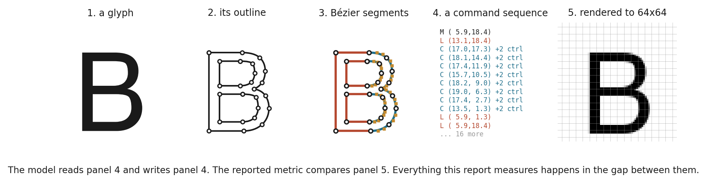
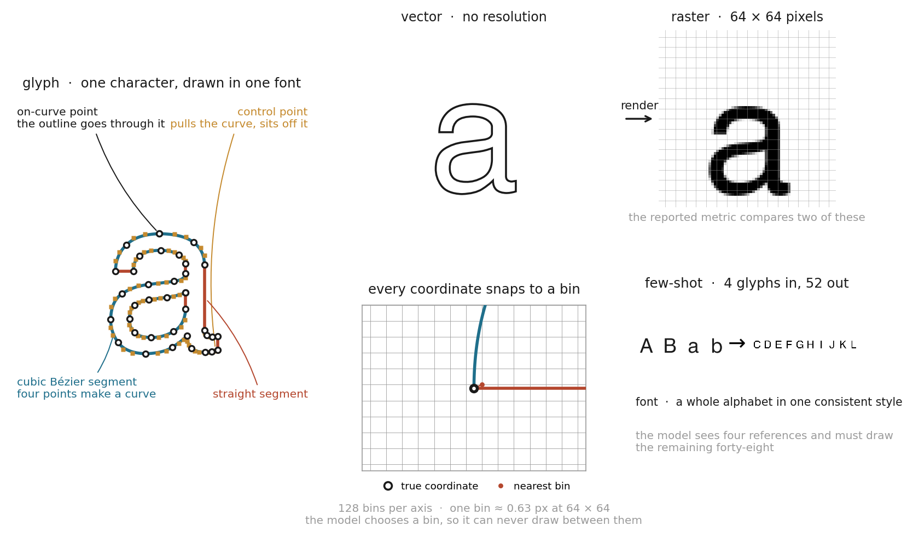
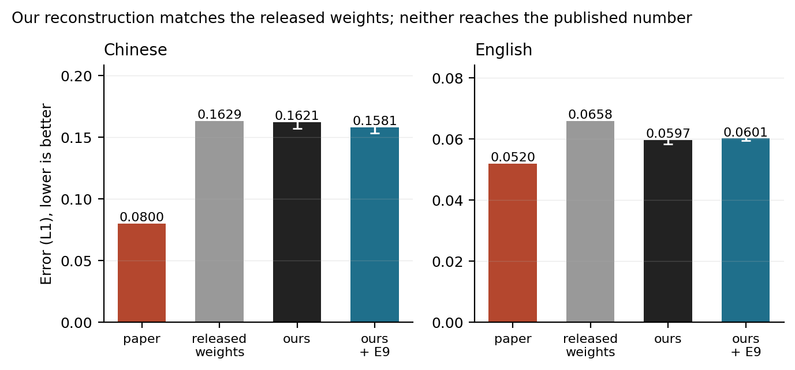
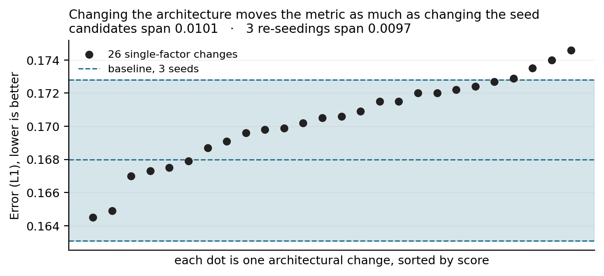
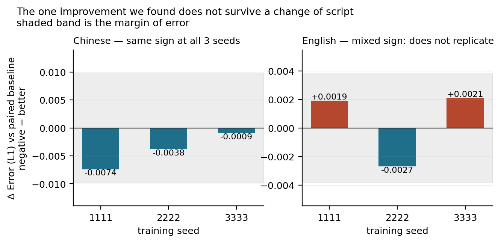
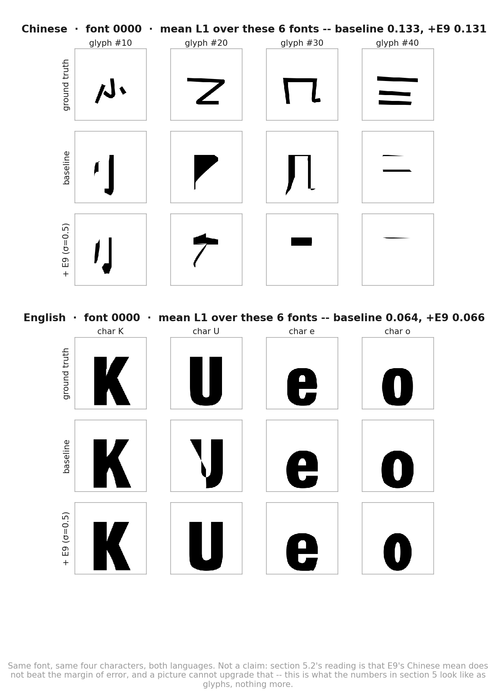
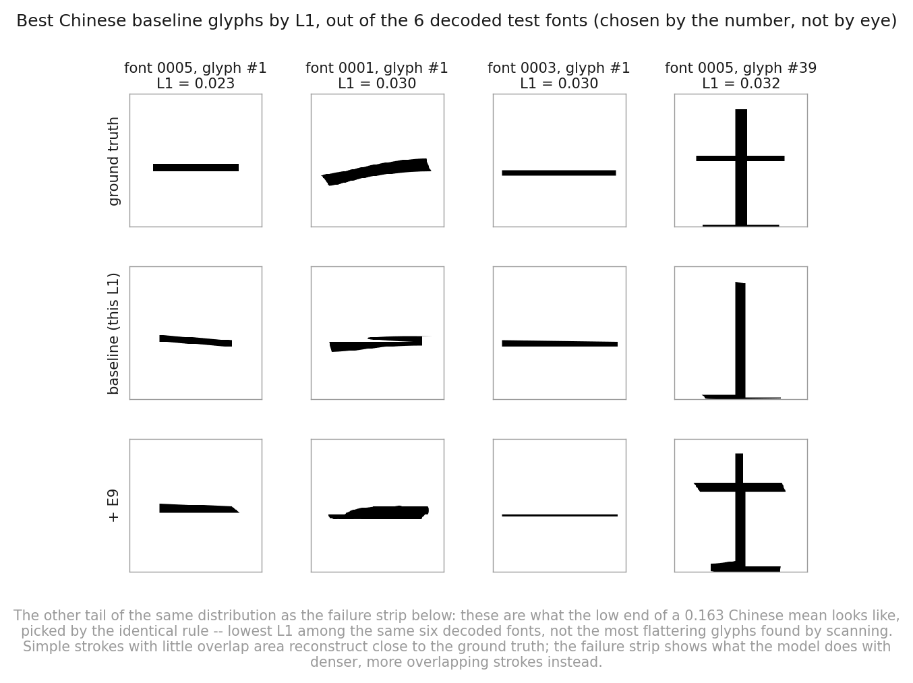
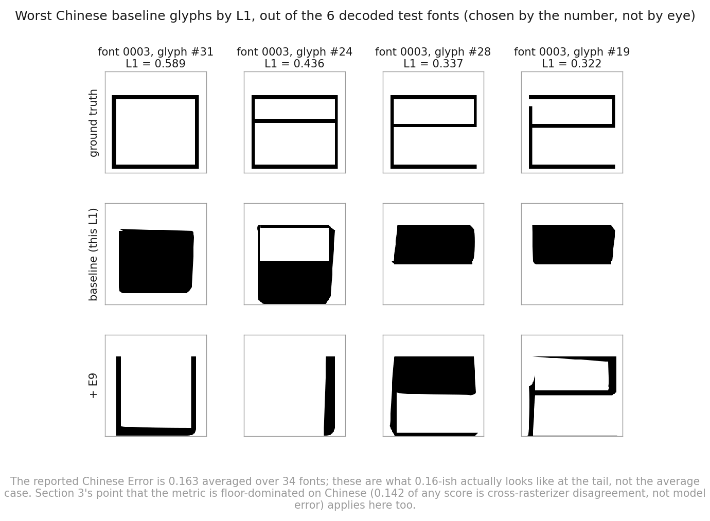

# DeepVecFont-v2: Reproduction and Architectural Sweep

### Measuring 21 single-factor changes against the model's own seed noise

Final project, part 2. Generative Models for Text and Images, Reichman University.

Paper: Wang, Wang, Yu, Zhu, Lian. *DeepVecFont-v2: Exploiting Transformers to Synthesize
Vector Fonts with Higher Quality.* CVPR 2023. Course topic: autoregressive models.
Code: fork of `yizhiwang96/deepvecfont-v2`, released at
`github.com/bensapirstein/deepvecfont-v2`. All our work is the `main..submission` diff.

*The letter B, from a font in the English test split, at five stages of the same pipeline: the
glyph as a designer drew it, its outline, the curves and lines that outline is built from, the
command sequence the model reads and writes, and the 64×64 rendering the score is computed on.
The model works in panel 4. The number everyone reports is measured in panel 5.*

## Abstract

A vector font is a set of drawing programs rather than a set of pictures: one command sequence
per character, each of which has to stay editable and legible at any size. That places font
synthesis closer to program synthesis than to image synthesis, and it is why the models that do
it well read and write both modalities of a glyph at once, the rendered image and the outline.
DeepVecFont-v2 (Wang et al., CVPR 2023) is the current form of that idea: a Transformer
encoder-decoder that sees a handful of reference glyphs, writes the command sequences for the
rest of the alphabet, and refines its own draft in a second decoding pass.

We reproduce the model on Chinese and English, check the reproduction against the authors'
released weights, and run 21 single-factor changes to the architecture against it, covering
every category the brief lists.

The measurement came first. Before changing anything we trained the unmodified baseline three
times under different random seeds, which puts the spread of the metric at 0.0097 on Chinese.
The 26 candidate configurations we went on to test span 0.0101 between them. Changing the
architecture moved the metric about as much as changing the seed. One candidate, E9, which
halves the noise added to the encoder during training, improves Chinese reconstruction with the
same sign at every seed on both metrics; because the effect sits inside the floor we committed
to in advance, we report it as a direction rather than as a gain of a stated size. One change
reliably degrades. The rest are indistinguishable from noise. A second batch, trained on a
rebuilt dataset with checkpoints selected on the rendered metric, returns the same reading from
a floor that came back wider still, and identifies checkpoint selection as the largest single
source of the spread the sweep was trying to read.

---

## Introduction

Automatic font generation is an old goal with a recent shape. A designer draws a few characters
and would like the rest of the alphabet to follow in the same style, and for scripts with large
character sets the argument is stronger: a Chinese font runs to tens of thousands of glyphs, all
of which have to agree with each other. Deep generative models handle the raster version of this
task well. The vector version, where the output has to be an outline a designer can open and
edit, has been harder, because that output is a variable-length sequence of discrete drawing
commands rather than a fixed grid of pixels.

DeepVecFont (Wang and Lian, ACM TOG 2021) set up the approach this project builds on. It encodes
both modalities of a glyph on the argument that they carry complementary information: the image
gives a global reading of shape, the command sequence gives the precise local structure a
designer actually edits. It generates the sequence with an RNN and a mixture density head, then
corrects the raw output by rendering it through a differentiable rasterizer and pulling the
result toward the synthesized image. That correction is what makes the outlines usable, and it
is also the weak point, because it fits the noise in the image guiding it. Its published
outlines show corners that are over-smoothed in some places and joins that are under-smoothed in
others.

DeepVecFont-v2 (Wang, Wang, Yu, Zhu, Lian, CVPR 2023) keeps the dual-modality premise and
replaces the machinery around it. Transformers take over from RNNs, which forces a change to the
outline representation itself: the ordinary SVG encoding lets each command inherit its starting
point from the one before, a convention that suits a recurrent model reading the sequence in
order and starves a Transformer reading it in parallel. So v2 writes every command with its own
start and end, and adds a relaxation representation so gradients can pass through the discrete
arguments. A Bézier alignment loss samples auxiliary points along the predicted curve and pulls
them onto the target curve, giving the model a signal about curve shape that control-point
supervision alone does not carry. And the post-hoc rasterizer correction gives way to a second
Transformer decoder that refines the whole sequence in context.

The gain from that redesign is 0.006 in reconstruction error on Chinese and 0.004 on English
(section 2). It is worth knowing that number before reading any of ours. Where a year of work on
a problem moves a metric bounded by 1 through six thousandths of a point, the question worth
asking about any further change is whether the difference it makes can be told apart from
retraining the same model with a different random seed. Section 4 takes that question literally
and answers it by measurement, and the answer governs how every result in section 5 is read.

This report covers the architecture (section 1), the paper's own results (section 2), our
reproduction of them (section 3), the changes we tested (section 4), what those changes returned
(section 5), and what we take from it (section 6).

---

## 1. Original architecture

DeepVecFont-v2 generates a full vector font from a few reference glyphs. It uses two
modalities at once: a 64×64 raster image of each glyph and the glyph's outline as a sequence
of drawing commands.

*A **glyph** is one character drawn in one style; a **font** is
a whole alphabet drawn consistently. Its **outline** is built from segments, either straight
or **cubic Bézier**, where each curve is fixed by two **on-curve points** it passes through
and two **control points** it does not. To **render** is to turn that outline into pixels.
The model never emits a raw coordinate: it picks one of 128 **bins** per axis, so it can
only place a point on that grid. And it works **few-shot**, seeing four reference glyphs and
having to draw the other forty-eight.*

**Encoders.** A CNN encodes the reference images. A Transformer encodes the reference
command sequences. The two are fused into one latent vector per font.

**Decoders.** Three heads read that latent. A CNN decodes a raster image. An autoregressive
Transformer decoder emits the command sequence one token at a time. A second Transformer
decoder then refines the whole sequence in parallel. **The refined sequence is what gets
scored**, which matters later.

**Representation.** Each command is a type plus 8 coordinate arguments. Coordinates are
quantized to a fixed grid of bins and predicted as a classification over bins, which is what
makes the model autoregressive rather than a regressor. The paper adds a relaxation
representation so gradients can flow through the discrete arguments, and a Bézier alignment
loss that pulls sampled points on the predicted curve toward the target curve.

**Loss.** A weighted sum of an image L1 term, a command-type cross-entropy, a coordinate-bin
cross-entropy, the Bézier alignment term, and a KL term on the latent.

**Key hyperparameters**, as shipped and as used by us:

| | Value |
|---|---|
| Optimizer, learning rate | Adam, 2e-4 |
| Batch size | 32 |
| Image size | 64×64 |
| Coordinate bins | 128 |
| Transformer width, encoder depth | 512, 6 |
| Reference glyphs | 4 (English), 8 (Chinese) |
| Max sequence length | 51 (English), 71 (Chinese) |
| Loss weights | image L1 10, Bézier 0.01, point 0.01 |
| Parameters | 136,055,207 |

### 1.1 Where the released code differs from the paper

We read the paper against the code. Four differences matter, and three of them became
experiments in section 4.

| Paper says | Code does |
|---|---|
| Coordinate arguments in **256** dimensions | quantizes to **128** bins |
| Self-refinement is a **2-layer** decoder | builds **1** layer |
| Bézier loss weighted at **1.0** | `loss_w_aux = 0.01`, 100× lower |
| The `N(0,I)` perturbation is an **inference-time** device | applied in training, validation and test alike |

Two more, found late, affect how our numbers compare to the published ones. The paper uses 10
samples per glyph on English and 50 on Chinese; we used 50 on both, which flatters our English
figures. And the paper enlarges the Chinese training set ten times by affine augmentation,
while our built dataset holds 1,272 entries over 212 base fonts, which is six times.

One more thing we found is not a paper discrepancy but is worth recording. The encoder builds
cross-attention modules and never calls them. They amount to 23,204,402 parameters, 17% of the
model, trained by the optimizer and used by nothing.

---

## 2. Paper results

The paper reports **reconstruction error**, written "Error" in its tables. The predicted
outline is rendered to a 64×64 image, the ground truth glyph is rendered the same size, and
the metric is the mean absolute difference between the two images. It is measured per glyph
and averaged. Lower is better. The model draws several candidate outlines per glyph and the
one with the highest overlap against the target is kept, so the reported number is a best-of-N
score rather than a single draw.

| Model | Error, English | Error, Chinese |
|---|---|---|
| DeepSVG | 0.125 | 0.167 |
| DeepVecFont | 0.056 | 0.086 |
| **DeepVecFont-v2** | **0.052** | **0.080** |

Note the scale. The paper's whole improvement over its own predecessor on Chinese is 0.006.
On a 64×64 image that is about 25 of 4,096 pixels. Every change we test in section 4 produces
a difference around that size or smaller, and section 5 is largely about whether such
differences can be measured at all.

The paper also reports two ablations. Its English ablation spans 0.0069 in total across four
rows. Its sampling-point study spans 0.0037 across six settings.

**The metric from the course material.** We were asked to add one metric studied in class
alongside the paper's original. We use **SSIM**, which compares local structure rather than
per-pixel difference and is standard for image quality. We implemented it in
`eval_reconstruction_error.py` and checked it against `skimage` to 1e-16. We also report
**s-IoU**, the intersection over union of the two rendered shapes, because the vector font
literature uses it and because it turned out to disagree with L1 often enough to be worth
carrying.

---

## 3. Reconstruction results

All numbers below are over the same 34 test fonts, best-of-50 decoding, with the ground truth
taken from the dataset's pre-rendered images.

| | Error (L1), lower is better | s-IoU, higher is better | SSIM, higher is better |
|---|---|---|---|
| Paper, Chinese | 0.080 | not reported | not reported |
| Released weights, Chinese, epoch 600 | 0.1629 | 0.3225 | 0.4373 |
| **Our reconstruction, Chinese**, 3-seed mean, 150 epochs | **0.1621** | 0.2681 | 0.4425 |
| Paper, English | 0.052 | not reported | not reported |
| Released weights, English, epoch 600 | 0.0658 | 0.7029 | 0.7181 |
| **Our reconstruction, English**, 3-seed mean, 630 epochs | **0.0597** | 0.7309 | 0.7374 |

We did not reach the published numbers. We did reproduce the released model, and those are
different claims.

**On Chinese our reconstruction sits 0.0008 from the authors' own checkpoint**, on a quarter
of the training budget. On English ours scores better than all three released checkpoints.

**Training longer does not close the remaining distance.** The released checkpoint has four
times our budget and lands in the same place, and our own Chinese runs taken to 600 epochs
select their best checkpoints at epochs 150 to 200 and score 0.1583.

The distance to 0.080 is therefore a property of the evaluation rather than of our training.
The comparison the brief asks for is the one against the released checkpoint, and that
comparison is the table above.

A 0.16 Chinese Error is an average, and an average hides what the tail looks like. Section 5.4
shows both tails from the same six freshly-decoded test fonts, picked by L1 rather than by eye,
alongside the qualitative baseline-versus-E9 comparison they belong next to.

Every English figure here used 50 samples per glyph where the paper uses 10. Scoring one fixed
checkpoint both ways puts that difference at 0.0027, so our English column is optimistic by
roughly that much.

---

## 4. Improved architecture

### 4.1 Establishing the noise floor

The paper's own margin is 0.006. Before trying to beat it we checked whether we could measure
anything that small. We trained the unmodified baseline three times, changing only the random
seed, and looked at how far apart the three scores landed.

**They span 0.0097 on Chinese and 0.0038 on English.** That spread is the bar. Any change
producing a smaller difference than this cannot be told apart from a lucky seed.

Two rules were written down before any candidate ran. A result must show the same sign at all
three seeds, so one good run is not a result. And every rule is fixed before the numbers
arrive; where we later overruled one, we recorded the overrule and the reason.

### 4.2 Candidate changes

We ran 21 distinct single-factor changes. Each moves one thing and holds everything else at
the baseline value. Every new option defaults to the released behaviour, and a preflight
script asserts that, so a candidate's default reproduces the baseline exactly.

Three candidates come from the paper-versus-code differences in section 1.1, and those are the
ones we expected most from, because each asks whether the paper's stated design or the shipped
code is better.

| Category from the brief | What we changed |
|---|---|
| Add normalization layers | terminal LayerNorm on the encoder (E1); batch norm in the image branch (E2) |
| Change the encoder or decoder | encoder width (E4); encoder depth 6→8 (E16); decoder feed-forward width 1024→2048 (E17) |
| Change the latent dimension | bottleneck 512→256 and →1024 (E5) |
| Add residual or attention layers | refinement decoder depth 1→2 and →3 (E3); encoder depth (E16) |
| Modify the loss function | Bézier weight 0.01→0.1/0.3/1.0 (E7); ordinal label smoothing (E8); KL weight (E12) |
| Change the noise schedule | encoder noise σ at train time (E9); warmup-cosine learning rate (E14) |
| Add regularization | dropout (E10); AdamW (E11); weight EMA (E15) |

All seven categories in the brief are covered, and one representative of each was rerun at
three seeds. That last part is the point: a coverage table built from single runs would show
breadth and prove nothing, for the reason section 5.2 gives.

### 4.3 Training-time encoder noise (E9)

**E9 sets the training-time encoder noise to σ = 0.5, half the released value.** It changes
when noise is added, not the architecture it is added to, so we read it and report it as a
training-dynamics intervention rather than an architectural change.

The reason is in section 1.1. The code adds `x + torch.randn_like(x)` to the encoder output on
every forward pass. The paper describes this perturbation as an inference-time device that
simulates the uncertainty of human design. It is not described as a training regularizer, and
it is applied as one.

We expected the released setting to be too strong. Full-strength noise on every training step
should blur the latent more than the reconstruction task wants, while keeping it at test time
still gives the sampling variety the paper is after. So we split the setting into two knobs,
one for training and one for test, and swept the training one down.

The noise is still drawn even when scaled to zero, so the random number stream stays aligned
across the sweep. Otherwise a change in σ would also be a change in initialization.

Two candidates did not survive contact with the code, and we report them rather than dropping
them. Instance normalization cannot compute a per-instance variance at the model's
`[32, 1024, 1, 1]` bottleneck, so E2 ran with batch norm only. And we never ran an ablation of
the 17% dead parameters, because removing them shifts the random stream for every module built
afterwards, which would make it partly an initialization change.

---

## 5. Improved results

### 5.1 Comparison with the paper and the released model

| | Paper | Released weights | Our reconstruction (mean ± sd) | E9, σ=0.5 (mean ± sd)† |
|---|---|---|---|---|
| **Chinese**, Error (L1), lower is better | 0.080 | 0.1629 | 0.1621 ± 0.0047 | 0.1581 ± 0.0046 |
| **Chinese**, s-IoU, higher is better | — | 0.3225 | 0.2681 ± 0.0122 | 0.2952 ± 0.0191 |
| **Chinese**, SSIM, higher is better | — | 0.4373 | 0.4425 ± 0.0057 | 0.4479 ± 0.0094 |
| **English**, Error (L1), lower is better | 0.052 | 0.0658 | 0.0597 ± 0.0021 | 0.0601 ± 0.0007 |
| **English**, s-IoU, higher is better | — | 0.7029 | 0.7309 ± 0.0065 | 0.7305 ± 0.0041 |
| **English**, SSIM, higher is better | — | 0.7181 | 0.7374 ± 0.0076 | 0.7358 ± 0.0005 |

Our columns are three-seed means ± sample standard deviation. †E9 improves Chinese on all
three metrics with the same sign at every seed (section 5.3). The effect sits inside the noise
floor we committed to in advance, so we report it as a direction rather than as a gain of a
stated size, and section 5.4 shows it does not carry over to English.

### 5.2 Candidate spread against seed spread

Twenty-six candidate configurations span 0.0101. Three runs of the unmodified model span
0.0097. Twenty-six draws from one distribution should cover roughly 2.3 times the range of
three; here the ratio is 1.07.

This has a direct consequence we can measure on our own results. Compared against a single
baseline run, **22 of 26 candidates beat the baseline**. Compared against the mean of three,
**6 of 26** do. The only difference is that the single run happened to land 0.0048 above the
mean, which is an ordinary draw. Twenty-two out of twenty-six reads as *almost anything helps*,
and it would have been our headline if we had not measured the spread first.

We can also price the mistake. Ranking candidates against that single run and re-running the
top three at two more seeds, **one of three survived**.

### 5.3 E9 on Chinese

Chinese, best-of-50, each candidate seed paired against the baseline seed of the same number.

| Seed | E9 Error | Δ vs paired baseline | E9 s-IoU | Δ |
|---|---|---|---|---|
| 1111 | 0.1588 | −0.0074 | 0.2870 | +0.0325 |
| 2222 | 0.1531 | −0.0038 | 0.3170 | +0.0454 |
| 3333 | 0.1623 | −0.0009 | 0.2816 | +0.0035 |
| **Mean** | **0.1581** | **−0.0040** | **0.2952** | **+0.0271** |

**Neither mean clears the bar we set.** The L1 gain of 0.0040 is inside the 0.0097 floor, and
the s-IoU gain of 0.0271 is inside the 0.0315 floor. What E9 has is the other thing we
required in advance: the same sign at every seed on both metrics, six out of six, on two
metrics that barely correlate with each other (r = −0.335). If they were independent, six
agreeing signs would happen by chance about 1 time in 64.

E9 is therefore a consistent direction rather than a demonstrated gain of a stated size, and
we report it that way. A narrower floor is available from the higher sampling budget, 0.0236,
and E9 clears that one, but the bar was set at 0.0315 before anything ran, and moving a bar
after seeing the numbers would cost the sweep the only thing that makes it readable.

### 5.4 E9 on English, and qualitative comparison

We repeated E9 on English at three seeds, paired the same way. One seed favours it on both
metrics and two go against it. Every difference is inside the English floor.

This was written down as a possible outcome before the runs started, so it is a result rather
than a failed experiment: **the one improvement we found does not survive a change of script.**

What baseline and E9 actually draw, ground truth alongside, same font and same four
characters on both languages:

English is close to solved at this scale; Chinese is not, and the two E9 columns are close
enough to each other that a reader should not expect to see the improvement in section 5.3 by
eye: 0.0040 L1 is about 16 of the image's 4096 pixels, a difference the metric can pick up
averaged over hundreds of glyphs but not one a single rendered comparison reliably shows.
(The L1 figures above these panels are computed over the six fonts decoded for this figure
alone, and are not meant to match the 34-font numbers in sections 3 and 5.1.)

The same six decoded Chinese fonts also bound the distribution behind that 0.163 mean. Section
3 said an average hides the tail; here is both ends of it, picked by L1 and not by eye, same
models as above. First the low end:

Then the high end:

The pattern at the bad end is consistent: three of these four glyphs, all simple rectangular
strokes in the ground truth, collapse into a solid filled block rather than an outline. E9 does
not repeat that pattern on the same four glyphs — it fills one, leaves one nearly blank, and
draws thin partial outlines on the other two — a different failure, not a smaller version of
the same one. At the good end the pattern is close to the mirror image: what survives is glyphs
with little stroke overlap to begin with, single bars and simple crosses, which is a property of
the glyph rather than something either model did well. Neither tail is an artifact of the
rendering, since every comparison above renders the *same* outline on both sides, so what the
panels show is the model drawing the right or the wrong thing. The spread between the two ends
is the kind of difference a 64×64 pixel-disagreement count is well suited to catching.

### 5.5 Remaining candidates

Everything else was null. Below are the one-per-category representatives, three seeds each on
Chinese, at matched checkpoint epoch, against a floor of 0.0097 and 0.0315.

| Change | Mean ΔError | Mean Δs-IoU | Reading |
|---|---|---|---|
| Batch norm in the image branch (E2) | −0.0066 | +0.0221 | same sign, under floor |
| Encoder width (E4) | +0.0059 | +0.0173 | mixed sign |
| Latent 256 (E5) | −0.0010 | +0.0203 | mixed sign |
| Bézier weight 0.1 (E7) | −0.0010 | −0.0053 | mixed sign |
| AdamW (E11) | −0.0011 | +0.0017 | mixed sign |
| Refinement depth 2 (E3) | −0.0004 | +0.0007 | mixed sign |
| Encoder depth 8 (E16) | +0.0025 | −0.0045 | mixed sign |
| Decoder width 2048 (E17) | +0.0005 | +0.0051 | mixed sign |

E2 is the only one with a consistent sign on both metrics, and both of its means sit under the
floor, so it does not pass either.

**One change did clear the bar, and it made things worse.** Adding a terminal LayerNorm to the
encoder (E1) degrades Chinese s-IoU at all three seeds by a mean of 0.0376, which is 1.2 times
the floor. This is the only effect anywhere in the project that exceeds its own bar in either
direction.

That number is a corrected one. Its first version read −0.0760, measured on checkpoints the
selection criterion had picked at epochs 100 and 125 against baselines at 150. Retraining and
re-reading those runs at a matched epoch halves the effect. It survives, and section 6.3 has
what we took from the audit.

**Running the same changes on English disagreed with Chinese.** Refinement depth 2 (E3) is
mixed-sign and null on Chinese, and on English it clears both floors in the degrading
direction at all three seeds. Latent 256 (E5) does the same. The same one-factor edit points
in opposite directions on the two scripts the paper reports.

### 5.6 Re-evaluation under corrected selection and augmentation

Two things about the protocol above are worth doubting. Checkpoints are selected on
`val_metric`, a validation criterion that section 6.3 measures at Spearman ρ = 0.125 against
the rendered metric, and the Chinese training set is augmented six times where the paper says
ten. Both are fixable, and fixing them asks whether the null reading is a property of the
benchmark or of our own setup.

Doing it properly needed a held-out split. `train.py` validates on the test split, so selecting
checkpoints on a rendered score computed there would be oracle selection rather than a fix. We
carved 20 Chinese base fonts out of the training set, decoded and rasterized them at every
checkpoint, and selected on those; at the same time we rebuilt the Chinese data at the paper's
10× augmentation, which also fixed a released `aug_rules` that silently duplicated one
transform. Twenty-seven runs, three baseline seeds plus E9, E1 and one representative of each
remaining category at three seeds each, were trained on the rebuilt data and scored on the
untouched 34-font test split under the section 5.1 protocol.

**The re-measured Chinese L1 floor is 0.0151** (baseline seeds 0.1534, 0.1560, 0.1685), half
again as wide as the 0.0097 section 4.1 measured on the original data. A better dataset and a
better selection rule made the instrument blunter, not sharper. **No candidate clears the new
floor.** E9 and E1 are not same-sign across seeds on L1, and the three that agree in sign stay
inside it.

| Change | Mean ΔL1 | Mean Δs-IoU | Reading (L1, the pre-committed metric) |
|---|---|---|---|
| Encoder noise σ=0.5 (E9) | +0.0064 | −0.0052 | mixed sign |
| Terminal LayerNorm (E1) | +0.0021 | −0.0310 | mixed sign |
| Batch norm in the image branch (E2) | −0.0068 | +0.0357 | same sign, under floor |
| Encoder width (E4) | +0.0048 | −0.0039 | same sign, under floor |
| Latent 256 (E5) | +0.0014 | +0.0031 | mixed sign |
| Bézier weight 0.1 (E7) | +0.0027 | −0.0048 | mixed sign |
| AdamW (E11) | +0.0014 | +0.0000 | mixed sign |
| Refinement depth 2 (E3) | +0.0061 | −0.0137 | same sign, under floor |

Deltas are against this batch's own baseline. Nothing here is comparable to section 5.5: a
different training set, a different training-set size, and a different selection rule. We
report the corrected floor as the finding and keep sections 5.1 through 5.5 as the substantive
results, with the caveat section 6.3 states. The English arm did not run, on the rule fixed
before training: a wider floor means less can be resolved, and idle hardware is not a reason to
go looking for a result the floor says is not there.

**The same batch answers what the spread in section 5.2 was made of.** Every run kept all six
checkpoints, each carrying both the old selection criterion and the rendered one, so which
checkpoint each rule would have chosen is on disk. They disagree on 21 of 27 runs, and where
they disagree, the checkpoint `val_metric` picks costs a mean of 0.0186 rendered L1 against the
one the rendered metric picks, which is above the re-measured floor on 20 of those 27 runs.
Checkpoint selection, rather than the architecture, was the largest single source of the
variation the sweep was reading. No individual row in section 5.5 is overturned by this, since
none was re-scored under the new criterion, but it is the strongest evidence this project
produced for the reading in section 6.3.

---

## 6. Discussion

### 6.1 Findings

The reproduction worked, and the way we checked it is the part worth keeping. Scoring the
authors' released weights through our own code turned "we fell short of 0.080" into a question
with an answer: our Chinese training lands 0.0008 from their released checkpoint on a quarter
of the budget, and our English training scores better than all three of theirs. Without a
released checkpoint to score, the strongest conclusion available would have been "probably
undertrained", which is what earlier drafts of this work carried.

Measuring the seed spread before running any candidate cost three training runs on the first
day and changed every conclusion after it.

Of the three candidates that came from reading the paper against its implementation, two
produced our two clearest results. Reading a paper against its code is a better source of
hypotheses than guessing at hyperparameters.

### 6.2 Null results

Eighteen of twenty-one changes did nothing measurable. We do not read this as evidence that the
changes were badly chosen. We read it as evidence that the benchmark cannot resolve changes of
this size.

Set our floors against the paper's own tables. Its English ablation spans 0.0069 across four
rows, with individual steps of 0.0031, 0.0028 and 0.0010, and its sampling-point study spans
0.0037 across six settings, with steps between 0.0002 and 0.0014. Our English floor is 0.0038
and our Chinese floor is 0.0097. **Most rows in the paper's own ablations differ by less than
our measured noise floor**, on the same metric and the same data.

That is not a claim that those results are wrong. It is a claim about what a single training
run per configuration can support. Neither the paper nor the work it compares against reports a
seed spread, so the published tables do not say either way.

E9 failing to transfer to English is the other thing that did not work, and it is informative
rather than merely disappointing. The same holds for the direction disagreement in section 5.5,
where one-factor edits point opposite ways on the two scripts the paper reports. A single
language licenses less than a two-language paper makes it look like it does.

### 6.3 Methodological implications

**A metric is a pipeline, not a formula.** "Mean absolute error between two 64×64 images" is not
enough information to reproduce a number. How many candidate outlines the best-of-N selection
draws from is worth 0.0027 on English, a quantity that is pure sampling budget with no model in
it, and larger than several of the differences the sweep set out to detect.

**A single-seed baseline reports the draw, not the change.** Section 5.2 has the numbers: 22 of
26 against 6 of 26, and a 1-in-3 survival rate for single-run leaders. This is the result we
would most want someone else to check, and checking it is cheap. Take a published vector font
ablation, retrain two rows at three seeds, and see whether the order holds.

**Checkpoint selection was measuring the wrong thing.** Checkpoints are chosen by a validation
score, and no term in that score is the quantity being reported: its largest term belongs to the
image decoder, while what gets scored comes from the refinement decoder's outline, rasterized.
We measured the consequence four ways. Across candidates it ranks at Spearman ρ = 0.125. Within
a run it puts epoch 100 above epoch 125 while every rendered metric says the opposite. It
prefers the authors' epoch-600 English checkpoint while every rendered metric prefers 500. And
adopted as the selection rule across five candidates, it never improved a rendered score and
flipped two of five from null to degrading.

Auditing it changed a result. E1's degradation was first measured at −0.0760 on checkpoints the
criterion had picked at epochs 100 and 125 against baselines at 150, so E1's two worst runs were
also its two earliest. At a matched epoch the effect halves to −0.0376 and still clears the
floor. Section 5.6 then measured the same defect across a whole batch and found it worth 0.0186
of rendered L1 wherever the two rules disagree, which is larger than most of what the sweep was
trying to detect. Human judgement failed the same way and is worth recording next to it: two
English runs were read from their training curves, one was stopped early on the shape of its
curve and has no result, and the other was read as promising and came back as our confirmed
degrading result.

### 6.4 Limitations

Every floor here rests on three seeds, so the bars themselves are uncertain, and section 5.6
moved both of them on a different training set and selection rule. Sections 5.1 through 5.5
select checkpoints on the criterion this section describes as defective; section 5.6 fixes it,
at the cost of every number in that section being unreadable against the ones before it.
English was scored on 34 fonts rather than the full 1,386, and at 50 samples per glyph rather
than the paper's 10. Nothing was run at more than three seeds.

### 6.5 Future work

More seeds first. Every bar in this report rests on three of them, and section 5.6 moved both
bars when it re-measured them, which is the clearest evidence we have that three seeds pin a
floor down loosely. Chinese runs cost about an hour each, so five or ten seeds is an affordable
way to tighten every comparison in section 5.

Then the output head. The decoder is autoregressive over quantized coordinate bins, and we
measured what the quantization itself costs by encoding ground truth outlines into the model's
own representation and decoding them back with no model involved. The released 128-bin grid
costs 0.0021 in L1 against unlimited precision, so the grid is not the bottleneck, but the
sequential factorization over it may be. A flow-matching head over continuous coordinates would
remove the quantization and the sequential decode together. We designed and costed one and
dropped it on schedule grounds rather than on merit; it is in `archive/FLOW_MATCHING_PLAN.md`.

Beyond this model, the measurement itself is the transferable part. Any ablation table in this
literature can be re-read the way section 5.2 re-reads ours, and the cost of doing so is two
retrainings per row.

---

## 7. References

1. Wang, Y., Wang, Y., Yu, L., Zhu, Y., Lian, Z. *DeepVecFont-v2: Exploiting Transformers to
   Synthesize Vector Fonts with Higher Quality.* CVPR 2023. arXiv:2303.14585.
2. Wang, Y., Lian, Z. *DeepVecFont: Synthesizing High-Quality Vector Fonts via Dual-Modality
   Learning.* ACM TOG 2021.
3. Carlier, A., Danelljan, M., Alahi, A., Timofte, R. *DeepSVG: A Hierarchical Generative
   Network for Vector Graphics Animation.* NeurIPS 2020.
4. Lopes, R. G., Ha, D., Eck, D., Shlens, J. *A Learned Representation for Scalable Vector
   Graphics.* ICCV 2019.
5. Liu, Y., Guo, F., Wang, Z., Zhang, D. *DualVector: Unsupervised Vector Font Synthesis with
   Dual-Part Representation.* CVPR 2023. Source of the SSIM / L1 / s-IoU reporting convention.
6. Wang, Z., Bovik, A. C., Sheikh, H. R., Simoncelli, E. P. *Image Quality Assessment: From
   Error Visibility to Structural Similarity.* IEEE TIP 2004. SSIM.
7. Xiong, R., et al. *On Layer Normalization in the Transformer Architecture.* ICML 2020. For E1.
8. Szegedy, C., Vanhoucke, V., Ioffe, S., Shlens, J., Wojna, Z. *Rethinking the Inception
   Architecture for Computer Vision.* CVPR 2016. Label smoothing, for E8.
9. Loshchilov, I., Hutter, F. *Decoupled Weight Decay Regularization.* ICLR 2019. AdamW, for E11.
10. Higgins, I., et al. *β-VAE: Learning Basic Visual Concepts with a Constrained Variational
    Framework.* ICLR 2017. For E12.
11. Jaegle, A., et al. *Perceiver: General Perception with Iterative Attention.* ICML 2021. The
    architecture the encoder's configuration advertises and does not instantiate.
12. Wilcoxon, F. *Individual Comparisons by Ranking Methods.* Biometrics Bulletin 1945. The
    paired test used per seed.
13. Lipman, Y., et al. *Flow Matching Guide and Code.* arXiv:2412.06264. On the course reading
    list; basis for the head proposed in section 6.5.

**Code, data and checkpoints.** Everything is at `github.com/bensapirstein/deepvecfont-v2`, a fork of
`github.com/yizhiwang96/deepvecfont-v2`. Branch `main` is a pristine mirror of upstream and was
never committed to, so **`git diff main..submission` is exactly what this project contributed**,
separated from the roughly fifteen thousand lines of released code it sits on. The delivered
tree is branch `submission`, tagged `v1.0-submission`. `docs/REPRODUCE.md` runs from a clean
conda environment to a rebuilt version of this PDF.

**The model code is one code path.** The reconstruction and the improved model are the same
`train.py`, `models/` and `test_few_shot.py`; E9 is `--enc_noise_std_train 0.5` on the training
command and nothing else. That holds for all 21 candidates: each is a flag that defaults to the
released behaviour, and a preflight script asserts every default reproduces the
baseline exactly. It is a weaker guarantee than it sounds, since it cannot catch a change that
is correct and irrelevant, but it does rule out the failure where a candidate appears to help
because it quietly moved something else as well.

**Data.** The authors' released Chinese and English sets, at their own download links, built by
`data_utils/`. Two departures are ours and both are one command in `docs/REPRODUCE.md`: the
Chinese rebuild at the paper's 10× augmentation that section 5.6 required, and the held-out
validation splits, which are committed as JSON in `data_splits/` because a checkpoint selected
on a split nobody can reconstruct is a checkpoint selected on nothing.

**Checkpoints** are on Google Drive, linked from the repository README: the Chinese baseline and
Chinese E9, the English baseline and English E9, seed 1111 in each case, with the run's
`checkpoint_metrics.csv` alongside so the selection is auditable rather than asserted. The
three-seed means in section 5.1 come from three such runs each; the released seed is the
representative draw, and every scored checkpoint in the project has a row in `RESULTS.csv`.

**What the repository deliberately does not carry.** No decode trees, no weights in git, and
none of the thirty days of runbooks, dated status tables and cluster notes the work actually
generated. Those stay on the `repro` branch, which is public for anyone who wants the process
rather than the result; `docs/PROVENANCE.md` on `submission` says where each citation in the
code points. Model outputs regenerate from the commands, and what was measured from them is in
`RESULTS.csv` instead.

**Nothing in this report is typed twice.** `RESULTS.csv` holds all 140 scored checkpoints, one
row each. Every figure is regenerated from it by `report/make_figures.py` and
`report/make_model_comparison_figures.py`, and every number quoted here is re-derived from it
and checked by `report/verify_report.py`, 81 assertions that exit non-zero on any mismatch and
that gate the PDF build. A figure or a number that has drifted from the results table stops the
build rather than reaching a submission.
